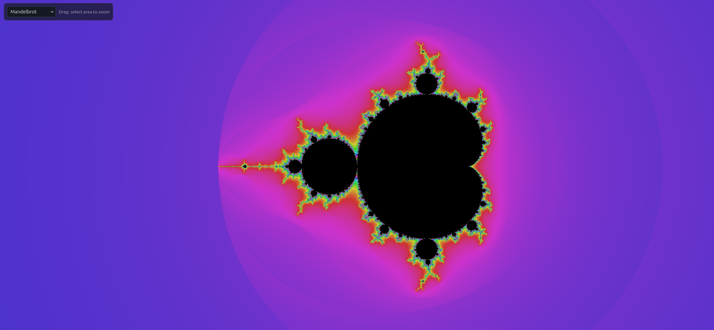
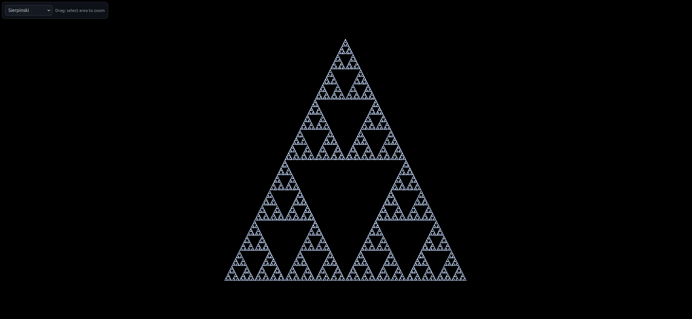
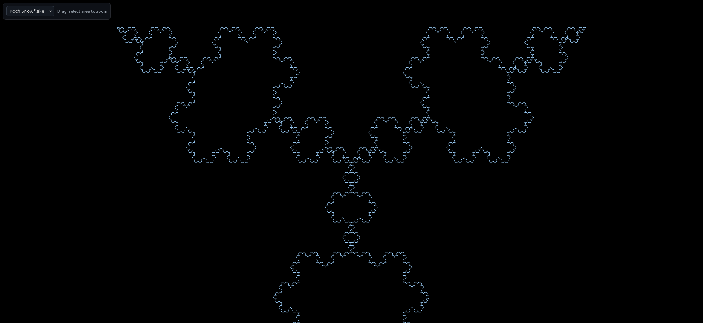

# HTML5 JS Fractal Viewer

An interactive, browser-based fractal viewer built with HTML5 Canvas, vanilla JavaScript, and simple CSS. Open the included HTML file in any modern browser to render and explore fractal imagery.

## Highlights

- Pure client-side (no build tools required)
- Renders fractals on an HTML5 Canvas
- Adjustable visual parameters (iterations, colors, scale) via source settings
- Lightweight, minimal dependencies
- Works offline when opened locally

## Supported Fractals

This viewer currently supports three fractal types:

- Mandelbrot Set
    
    

- Sierpinski Triangle
    
    

- Koch Snowflake
    
    

## Project Structure

- FractalViewer.html — Entry point; bootstraps the canvas and UI.
- css/
    - FractalCanvasStyles.css — Base styles (layout, UI, canvas, selection rectangle).
    - Mandelbrot.css — Per-fractal style tokens.
    - Sierpinski.css — Per-fractal style tokens.
    - KochSnowflake.css — Per-fractal style tokens.
- js/
    - FractalRenderer.js — Core viewer: canvas management, view/zoom, and rendering orchestration.
    - Mandelbrot.js — Mandelbrot fractal module.
    - Sierpinski.js — Sierpinski triangle module.
    - KochSnowflake.js — Koch snowflake module.
- docs/
    - Mandelbrot.png — Preview image.
    - Sierpinski.png — Preview image.
    - Koch_snowflake.png — Preview image.

## Quick Start

- Run it one of the following ways:
    - Locally: open the file `FractalViewer.html` directly in a modern browser (double‑click it or drag it into a browser window).
    - Hosted (GitHub Pages): this repository is published via GitHub Pages, open:
      [https://tardigrada07.github.io/html5-js-fractal/FractalViewer.html](https://tardigrada07.github.io/html5-js-fractal/FractalViewer.html)

## Usage

- Launch the viewer as described above.
- Use the dropdown to switch between fractals and drag-select on the canvas to zoom into a region.
- For customization:
    - Adjust defaults (e.g., iterations, colors) in the corresponding files under `js/` for each fractal.
    - Update styles or tokens in `css/` to tweak layout and appearance.

## Performance Tips

- Lower the maximum iteration count for smoother interaction on lower-end devices.
- Reduce canvas resolution (width/height) to increase rendering speed.
- Avoid running multiple heavy tabs while exploring deep zooms.